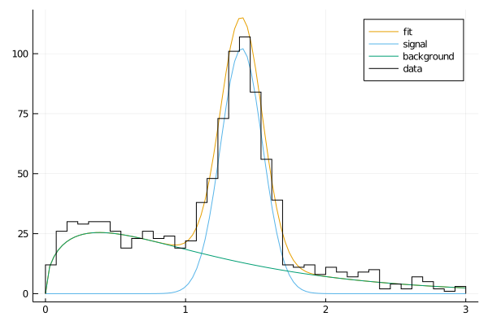

# AlgebraPDF

[](https://github.com/mmikhasenko/AlgebraPDF.jl/actions)
[](https://codecov.io/gh/mmikhasenko/AlgebraPDF.jl)

Basic functionality:
 * constructing a pdf object from arbitraty function:
    - required function format `myfunc(x;p)` where `p` is a NamedTuple of parameters
    - the normalization is computed automatically using `QuadGK.jl` in the giben `lims`
    - algebra of functions with parameters: `*`, `+`, `-`, `/`
 * construction of mixed models in the form `f₁ PDF₁ + f₂ PDF₂ + (1-f₁-f₂) PDF₃`.
 * fitting data distribution using the maximum likelihood (`Optim.jl`)
 * plotting recipies

```julia
using AlgebraPDF
using Plots
theme(:wong)

# create a model
snl = aGauss((μ=1.4, σ=0.15), (0, 3))
bkg = pdf(@. (x;p) -> sqrt(x)*exp(-p.α*x); p = (α=1.3,), lims=(0, 3))
bkg_f = bkg * (fb=2.5,)
pdf_sum = snl + bkg_f

# generating
const data = generate(1000, pdf_sum);

# fitting
fr = fit_llh(data, pdf_sum; init_pars=p2v(pdf_sum))
pfr = v2p(minimizer(fr), pdf_sum) # NamedTuple (parameter = value, ...)
efr = v2p(errors(fr), pdf_sum) # NamedTuple (parameter = error, ...)
mfr = v2p(measurements(fr), pdf_sum) # NamedTuple (parameter = value ± error, ...)

# plotting
let
  plot()
  plot!(x->pdf_sum(x; p=pfr), lims(pdf_sum)..., lab="fit")
  plot!(x->snl(x; p=pfr, norm_according_to=pdf_sum), lims(pdf_sum)..., lab="signal")
  plot!(x->bkg(x; p=pfr, norm_according_to=pdf_sum), lims(pdf_sum)..., lab="background")
  stephist!(data, norm=true, c=:black, bins=50, lab="data")
end

# Alternatively one can use a mixed model
model = MixedModel([snl, bkg], (fS = 0.5,))
fr = fit_llh(data, model)
pfr = v2p(minimizer(fr), pdf_sum)
fixed_model = fixpars(model, pfr)
# 
let
  Nd = length(data)
  bins = range(lims(fixed_model)..., length = 40)
  Ns = scaletobinneddata(Nd, bins)
  #
  plot(pdf_sum, Ns, lab="fit")
  plot!(pdf_sum.components[1], fractions(fixed_model)[1]*Ns, lab="signal")
  plot!(pdf_sum.components[2], fractions(fixed_model)[2]*Ns, lab="background")
  stephist!(data, c=:black, bins=bins, lab="data")
end
```


